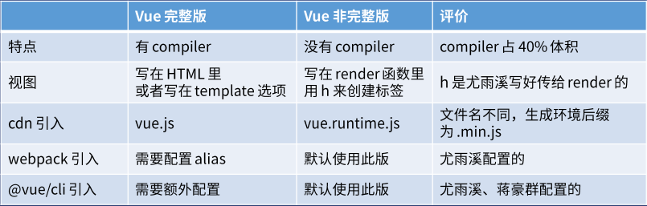

# Vue两个版本的区别和用法
Vue官网提供了两个版本，分别是开发版和生产版：开发版包含了有帮助的命令行警告，而生产版则不包含这些警告，但它优化了尺寸和速度。下面我们来看看它们的具体区别：


> 一般来说，总是使用非完整版，然后配合vue-loader和vue文件，vue-loader可以把vue文件里的html转化为h函数。
------------
# template 和 render 的使用方法

template，译为模板，在完整版中使用它，一般有三种使用方法：
①写在构造函数中：
```JS
new Vue({
    el:'#app',
    template:'<div>hi</div>'  //会自动渲染在绑定#app的页面中
})

```

②写在template标签里:
```JS
<div id="app">
  <template id="tem"><h3>模板</h3></template>
</div>
<script>
  new Vue({
      el:'#app',
      template:"#tem"
  })
</script>

```

③写在script标签里
```JS
<div id="app">
  <template id="tem"><h3>模板</h3></template>
</div>
<script>
  new Vue({
      el:'#app',
      template:"#tem"
  })
</script>

```

render则一般在非完整版函数中使用，它也有三种使用方法：
①在构造函数中使用：
```JS
new({
    el:'#app',
    render:createElement=>createElement('div',['HelloVue'])
})
```
②向render传入配置对象：
```JS
var app={
    template:'<div>{{name}}</div>',
    data(){
        return {
            name:'jack'
        }
    }
}

new Vue({
    el:'#app',
    render:createElement=>createElement(app)
})

```

③：
```JS
var app={
    render:createElement=>createElement('div',['HelloVue'])
}

new Vue({
    el:'#app',
    render:createElement=>createElement(app)
})

```
